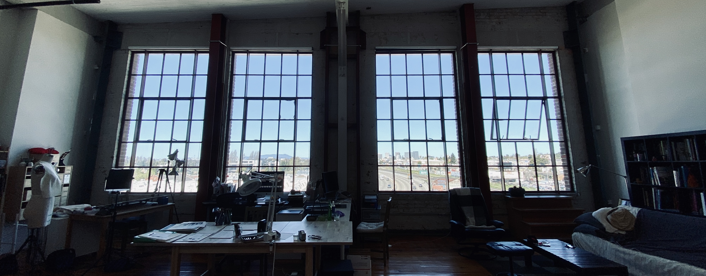

👏 Hey there, I'm Assaf.

👨💼 I ship software that people actually use. These days I write less code, I steward AI agents to write most of it, and I devote my time to design, review, testing, and avoiding the slop. Turns out that's a better use of my skills.

🧪 I've been building developer tools since before it was a startup category: [Zombie](https://github.com/assaf/zombie) (headless browser testing), [Vanity](https://github.com/assaf/vanity) (A/B testing), [node-replay](https://github.com/assaf/node-replay) (HTTP record/replay), and a pile of other libraries.

🚀 Right now I'm working on [Expense](https://github.com/assaf/expense) (expense tracking for the self-employed) and a couple of things I'll talk about when they're ready.

🟢 I take on **one part-time client** (20~30 hrs/week, remote): senior JavaScript/TypeScript, end-to-end features, with test coverage and docs. If your startup needs to ship, [hit me up](mailto:assaf@labnotes.org).

☕ You can find me on [Mastodon](https://mas.to/deck/@assaf), [labnotes.org](https://labnotes.org), [LinkedIn](https://www.linkedin.com/in/assafarkin/), and via snail email 📬 [assaf@labnotes.org](mailto:assaf@labnotes.org).
